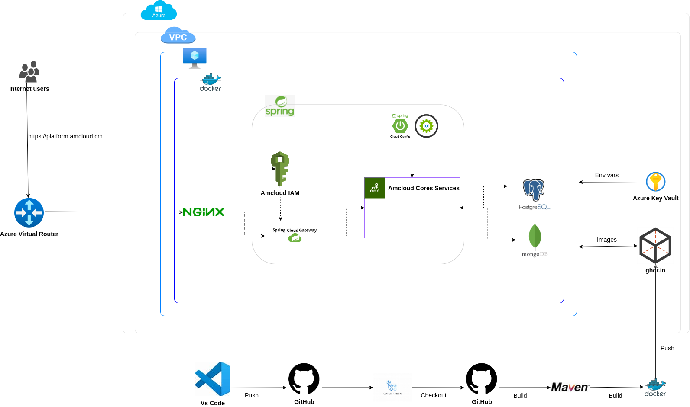

# amcloud-platform

## Description
amcloud-platform is the main repository for the AMCLOUD ecosystem, serving as the centralized entry point for deploying and managing the platform across various environments, including local setups, cloud environments like Azure, and hybrid infrastructures.  

This repository orchestrates the deployment of all microservices that form the AMCLOUD ecosystem, ensuring seamless integration and communication between them. Each microservice plays a specific role in the platform:

- **[IAM (Identity and Access Management)](https://github.com/Project-In3-Uds/amcloud-iam)**: Handles authentication, authorization, and user management, enabling secure access control across microservices.
- **[Gateway](https://github.com/Project-In3-Uds/amcloud-gateway)**: Acts as the API Gateway, managing routing, authentication, and authorization for microservices, ensuring secure and efficient communication.
- **[Config Server](https://github.com/Project-In3-Uds/amcloud-config-server)**: Centralizes and manages configuration properties for microservices, enabling dynamic and secure updates.
- **[Billing](https://github.com/Project-In3-Uds/amcloud-billing)**: Manages billing creation, updates, and retrieval, supporting subscription and payment workflows.
- **[Reservation](https://github.com/Project-In3-Uds/amcloud-reservation)**: Handles reservation creation, updates, and retrieval, facilitating booking and scheduling processes.
- **[Notification](https://github.com/Project-In3-Uds/amcloud-notification)**: Sends notifications to users, ensuring timely communication and updates.
- **[Invitation](https://github.com/Project-In3-Uds/amcloud-invitation)**: Manages invitation creation, updates, and retrieval, supporting user onboarding and event invitations.

Additionally, this repository includes Docker Compose configurations for orchestrating the microservices, making it easy to deploy the platform in any environment.

## Prerequisites

- Docker and Docker Compose (required for deployment)
- Git
- [Optional] Java JDK 17 or higher (for local development of individual microservices)
- [Optional] Maven 3.9+ (for building individual microservices)

## Repository Structure

```
amcloud-platform/
├── azure/                        # Azure deployment configurations
├── certs/                        # SSL certificates for secure communication
├── docker/                       # Docker configurations for individual microservices
├── docker-compose.yml            # Docker Compose configuration for orchestrating microservices
├── env/                          # Environment variable files for microservices
├── init-scripts/                 # Database initialization scripts
├── nginx/                        # NGINX configuration files for reverse proxy
├── restClient-Tests/             # REST client test files for microservices
├── scripts/                      # Utility scripts for setup and maintenance
├── docs/                         # Documentation and diagrams for the platform
└── README.md                     # Project overview and instructions
```

## Installation & Setup

### Step 1: Clone the Repository
```bash
git clone https://github.com/Project-In3-Uds/amcloud-platform.git
cd amcloud-platform
```

### Step 2: Configure Environment Variables
Environment variable files are ignored by `.gitignore` for security reasons.  
Each `.env` file must follow the naming convention `.env.[SERVICE_NAME]`.  

Example for `env/.env.config-server`:
```bash
# === GitHub Configuration ===
GIT_URI=https://github.com/Project-In3-Uds/amcloud-config-server
GITHUB_USERNAME=Projects-In3-Uds
GITHUB_TOKEN=your_github_token_here
GITHUB_BRANCH=main

# === Server Ports ===
CONFIG_SERVER_PORT=8888
```

For examples of `.env` files for other services, refer to their respective README files:
- [amcloud-gateway README](https://github.com/Project-In3-Uds/amcloud-gateway/blob/main/README.md)
- [amcloud-iam README](https://github.com/Project-In3-Uds/amcloud-iam/blob/main/README.md)
- [amcloud-reservation README](https://github.com/Project-In3-Uds/amcloud-reservation/blob/main/README.md)
- [amcloud-billing README](https://github.com/Project-In3-Uds/amcloud-billing/blob/main/README.md)
- [amcloud-notification README](https://github.com/Project-In3-Uds/amcloud-notification/blob/main/README.md)
- [amcloud-invitation README](https://github.com/Project-In3-Uds/amcloud-invitation/blob/main/README.md)

### Step 3: Start Services with Docker Compose
Run the following command to start all microservices:
```bash
docker-compose up -d
```

Or start each microservice individually :
```bash
docker-compose up -d iam
```

### Step 4: Verify Services
Check services status and thiers healthy state
```bash
docker-compose ps
```  

And for more informations or further troubleshooting
```bash
docker-compose logs
``` 

## Architecture Overview

Below is the architecture diagram showing how the microservices interact within the AMCLOUD ecosystem:



## Known Issues / Limitations

- Requires Docker Compose for deployment.
- Each microservice must be configured individually using `.env` files.
- No centralized rate-limiting or circuit breaker by default (consider adding these features in production).

## Support / Contact

- For questions or support, [open an issue](https://github.com/Project-In3-Uds/amcloud-platform/issues).
- For real-time discussion, contact us at project.in3.uds@outlook.com.

## Contribution

We welcome contributions! Please read our [CONTRIBUTING.md](CONTRIBUTING.md) and [CODE_OF_CONDUCT.md](CODE_OF_CONDUCT.md) before submitting a pull request.

## License

This project is licensed under the Apache License 2.0. See the [LICENSE](LICENSE) file for details.

## Credits

Developed by Project-In3-Uds contributors.  
Special thanks to all open-source libraries and the community!
