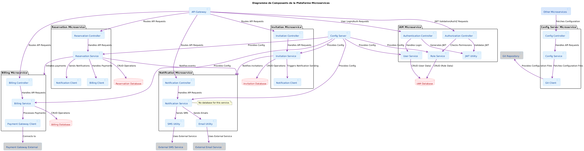

# Microservices Architecture

This section documents the microservices-based software architecture for our project.

---

## Microservices Overview

**Diagram Objective:**  
Present all the microservices that make up the application, their main interactions, and major dependencies (databases, external services).  
This diagram answers the question:  
> “What microservices exist, who communicates with whom, and what are the major technical components?”

  
*Diagram generated with PlantUML. See the source file in `docs/diagram-codes/microservices-overview.puml`.*

---

## Component Diagram

**Diagram Objective:**  
Show the internal organization of a microservice or subsystem: modules, software components, internal relationships, adapters, etc.  
This diagram answers the question:  
> “What is each microservice composed of? What are the main classes/modules/adapters?”

  
*Diagram generated with PlantUML. See the source file in `docs/diagram-codes/microservices-component.puml`.*

---

## Data Flow Between Microservices

**Diagram Objective:**  
Visualize the main data exchanges and calls between microservices, including the directions of the flows (who requests from whom, what data or events circulate).  
This diagram answers the question:  
> “What are the paths taken by data or calls between services?”

  
*Diagram generated with PlantUML. See the source file in `docs/diagram-codes/microservices-dataflow.puml`.*

---

## Sequence Diagram

**Diagram Objective:**  
Describe a specific dynamic interaction scenario between microservices for a given business flow, step by step (e.g., creating a reservation, with billing and sending an email with the ticket attached).  
This diagram answers the question:  
> “What are the steps and the order of exchanges to perform a business action?”

  
*Diagram generated with PlantUML. See the source file in `docs/diagram-codes/microservices-sequence.puml`.*

---

## Deployment Diagram

**Diagram Objective:**  
Show the physical architecture: where the microservices are deployed, with what technologies, on which servers/containers/cloud, what network connections, etc.  
This diagram answers the question:  
> “Where do the microservices run? How are they distributed across the infrastructure (VM, Docker, cloud, etc.)?”

  
*Diagram generated with PlantUML. See the source file in `docs/diagram-codes/microservices-deployment.puml`.*

---

## Communication Principles

Microservices primarily communicate via REST APIs (HTTP/JSON).

- **Protocol:** HTTP (REST)
- **Exchange Format:** JSON
- **Synchronicity:** Mainly synchronous (request/response)
- **Authentication:** JWT (via IAM) or OAuth2 (if configured)
- **Centralized Configuration:** Config Server (via GitHub)
- **No message broker currently** (Kafka, RabbitMQ, etc.)

---

## Responsibilities of Each Service

| Service         | Main Role                                | Main Endpoints                   | Dependencies        |
|-----------------|------------------------------------------|----------------------------------|---------------------|
| **API Gateway** | Request routing, security                | `/api/*`                         | IAM, other services |
| **IAM**         | Identity & access management             | `/auth/*`                        | PostgreSQL          |
| **Reservation** | Reservation management                   | `/reservations/*`                | Notification, Billing|
| **Invitation**  | Invitation management                    | `/invitations/*`                 | Notification        |
| **Notification**| Email/SMS sending                        | `/notifications/*`               | SMTP, IAM           |
| **Billing**     | Billing and payments                     | `/billing/*`                     | PostgreSQL          |
| **Config Server**| Centralized configuration management     | `/config/*`                      | GitHub (config)     |

---

## Dependencies and Interactions

### IAM
- **Role:** Authentication and authorization via JWT.
- **Dependencies:** PostgreSQL for managing users and roles.
- **Interaction:** Provides JWT tokens used by all other services via the API Gateway.

### API Gateway
- **Role:** Centralizes user requests and applies security rules.
- **Dependencies:** IAM for JWT validation, Config Server for dynamic routes.
- **Interaction:** Routes requests to microservices while adding custom headers (e.g., `X-User-ID`).

### Config Server
- **Role:** Provides dynamic configurations to microservices.
- **Dependencies:** GitHub for storing configuration files.
- **Interaction:** Microservices fetch their configurations at startup.

### Reservation
- **Role:** Manages user reservations.
- **Dependencies:** Notification for informing users, Billing for payments related to reservations.
- **Interaction:** Uses JWT to secure requests via the API Gateway.

### Invitation
- **Role:** Manages invitations sent to users.
- **Dependencies:** Notification for sending invitations.
- **Interaction:** Uses JWT to secure requests via the API Gateway.

### Notification
- **Role:** Sends notifications via email or SMS.
- **Dependencies:** SMTP for emails, IAM for user validation.
- **Interaction:** Uses JWT to secure requests via the API Gateway.

### Billing
- **Role:** Manages billing and payments.
- **Dependencies:** PostgreSQL for storing billing data.
- **Interaction:** Uses JWT to secure requests via the API Gateway.

---

## Coming Soon

- Deployment diagram for local and cloud environments (Azure).
- CI/CD integration diagram for automating deployments.
- Evolution if adding a broker or other communication modes (e.g., Kafka, RabbitMQ).

---
